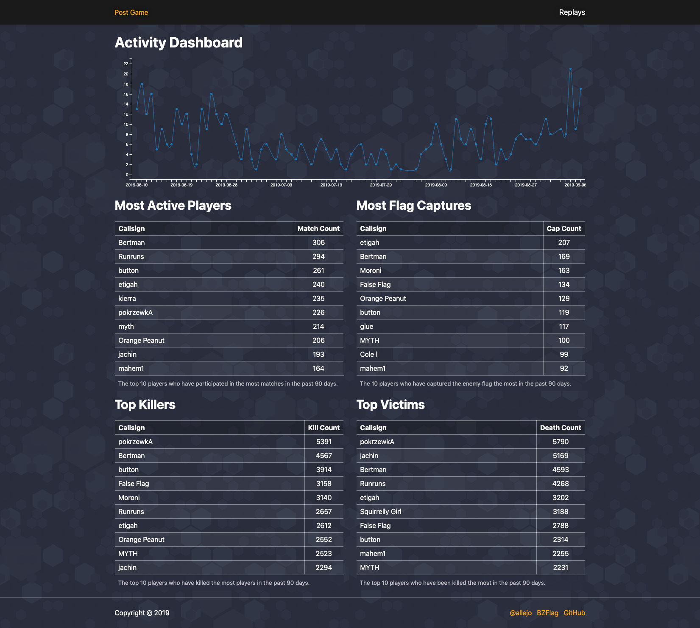
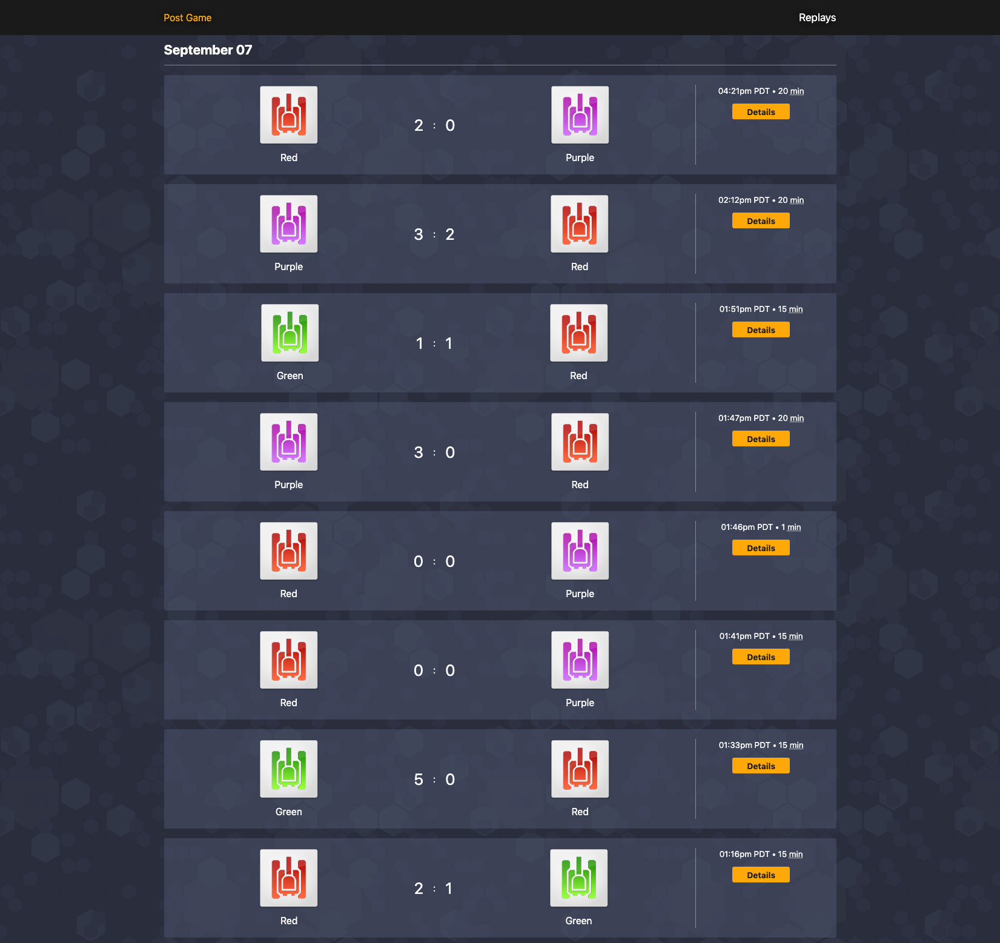
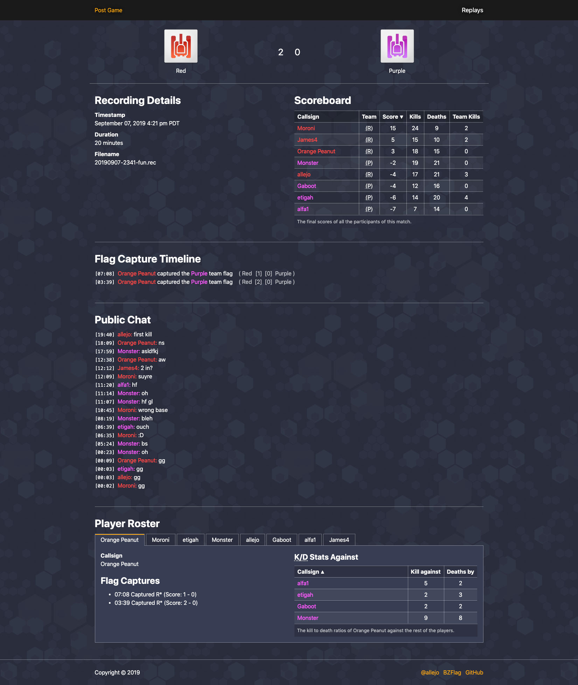

# Postgame

[](https://github.com/allejo/postgame/releases/latest)
[](https://github.com/allejo/postgame/blob/master/LICENSE.md)

A Symfony 4 website for summarizing BZFlag replay files.

<table>
<tr>
<td></td>
<td></td>
<td></td>
</tr>
</table>

## Project Setup

This project follows the standard Symfony 4 way of doing things, meaning Yarn + Webpack Encore for front-end assets and Symfony + Twig for back-end.

Additionally, this project is using the experimental [BZFlag style-guide](https://github.com/BZFlag-Dev/style-guide) for its front-end design.

### Setup

1. Pull down the necessary submodules with `git submodule update --init`
2. Duplicate `.env` to an `.env.local` file in the root of the project
3. Set the `DATABASE_URL` environment variable

### Production Deployment

To deploy to production, you don't need to install development dependencies.

```bash
# Install dependencies
composer install --no-dev --optimize-autoloader
yarn install --production

# Build our front-end assets
yarn build

# Setup Symfony cache
APP_ENV=prod APP_DEBUG=0 bin/console cache:clear

# Migrate database schemas
bin/console doctrine:migrations:migrate
```

Once you've built everything, point your web server to the `public/` folder.

### Local Development

For local development, you'll need to install development dependencies and run local processes.

```bash
# Install dependencies
composer install
yarn install

# Migrate database schemas
bin/console doctrine:migrations:migrate

# Run the CSS + JS build script in one terminal
yarn encore dev --watch

# (Optional) Run the PHP web server in another terminal. Otherwise, you'll
# need a local web server pointing to `public/`.
bin/console server:run
```

## Site Administration

Once you've got the site configured and running, you'll want to manage replay files.

### Importing Replays

You can import a single replay file or a directory of replay files. Replay files will only be imported once and duplicates will be ignored. Duplicates are determined by the SHA1 hash of the file; on import, replay files have their SHA1 values saved in the database.

```bash
bin/console app:replay:import <single file or directory of replays>
```

In order to force an upgrade of a replay file, use the `--upgrade` flag. This flag will keep the replay ID (so URLs don't break) but all other stats and events related to the replay will be deleted and imported again. This is useful for when new analysis options are available or there are bugs in the import process and require a reimport.

For running a cron job of imports, the `--after` option is available where you can set values such as `--after="-2 days"`. When given a directory of replay files, only replays that have been touched in the past 2 days would be imported. This is helpful so you don't try reimporting thousands of replays each time.

For a full list of all available options, use the `help` command.

```bash
bin/console help app:replay:import
```

### Deleting Replays

If you'd like to delete a replay from your database, get the ID of the replay and use the `app:replay:delete` command. This will perform a hard delete of the replay and cannot be undone; the URL for the given replay will break.

If there was a mistake in the import of a replay, consider using the `--upgrade` option in the import command.

```bash
bin/console app:replay:delete <replay id>
```

## License

[MIT](./LICENSE.md)
